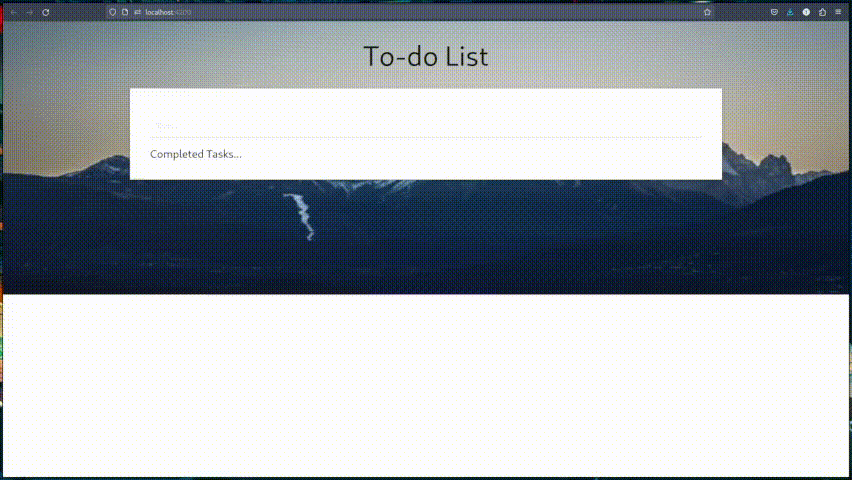

# Todo App 
---
This is a simple todo app that allows you to create and manage your daily tasks.This is also my first attempt in making an functional web app using Angular.Js FrameWork. 

### Demo 
---

![SS] (./Readme Files/Screenshot 2023-05-02 at 00-43-18 Todoapp.png)
---
### Features 

- Create a new task
- Mark a task as completed
- Delete a task
- View all tasks
- View only completed tasks
- View only incomplete tasks

### Technologies Used 

- Angular

### Usage 

- To create a new task, enter a task name in the input field and click on the "Add" button.
- To mark a task as completed, click on the checkbox next to the task.
- To delete a task, click on the "Delete" button next to the task.
- To view all tasks, click on the "All" button.
- To view only completed tasks, click on the "Completed" button.
- To view only incomplete tasks, click on the "Incomplete" button.

### Future Planning 

- Make it Persitant
- Create Cloud Integration

### Acknowledgements 

This app was created as part of a tutorial on building a todo app.
